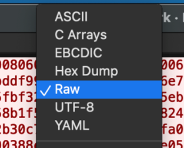

# Forensic

## Hidden in Plain Graphic

### Executive Summary

This challenge involved analyzing network traffic **_pcap_** file to uncover a hidden PNG file. After extracting and inspecting the image, we discovered the flag hidden using steganography

### Challenge Overview

We were given a **_.pcap_** file and asked to investigate for hidden data. The goal was to locate and extract a hidden flag potentially embedded in a transmitted file.

### Tools used

1. Wireshark
2. Aperisolve

### Static Analysis

1. First, sort by length (descending) in Wireshark to spot large packets that might contain file data.
2. We found this suspiciously large data file.
   
3. Follow the TCP stream of the suspicious packets.
   
4. Within the stream, we found **_PNG_** file headers.
   
5. We exported the **_raw_** sream data file. (switching to raw is important)
   
6. Upon saving the file as **_.png_** and opening the file, we confirmed it's an image.
7. Uploading the PNG to **_Aperisolve_** to scan for embedded steganographic data.
   
8. Flag: `umcs{h1dd3n_1n_png_st3g}`
   

### Takeaways

This challenge highlights how data can be quietly hidden in seemingly ordinary traffic. Knowing what file signatures look like and using tools like Aperisolve is key to solving basic stego-over-network forensics.

# Steganography

## Broken

### Executive Summary

A suspicious **_broken.mp4_** file was suspected of containing a hidden flag. Initial attempts to play the file failed, indicating structural corruption. Through a combination of static analysis, binary inspection, and media recover techniques, the file was repaired and a hidden flag was succesfully extracted from the video frame.

### Case Details

**_Objective_**: Recover the hidden flag from a corrupted **_broken.mp4_** file provided during the forensic challenge
**_Initial Observation:_**:
• The file could not be played in any media player.
• Tools like **_ffmpeg_** and **_exiftool_** were used for deeper inspection.
• Manual binary inspection via hex editor suggested intentional tampering.

### Requirements

• Knowledge of MP4 file structure (ftyp, moov, mdat atoms).
• Familiarity with ffmpeg, exiftool, and hex editors for static analysis.
• Understanding of video encoding schemes (H.264 in this case)
• Ability to reconstruct or repair partial media file structures.

### Static Analysis

1. Hex inspection & obtain a sample.
   Key points:
   • **_ftypisom_** header, this indicate that it is ISO Base Media file MPEG-4
   
   • **_H264 encoded format_**
   
   To solve this, we thought of obtaining a sample for ease of comparison by recording with OBS since OBS allows to tweak the recording output format, so we screenrecorded under **_H264_** encoding and output as **_.mp4_** file
2. Comparative Sample Analysis
   | Original | Sample |
   | -------- | ------- |
   | | |

Notice that the file header of ftypisom type of .mp4 file header should be started with \x00\x00\x00\x02 followed by magic bytes ftypisom, hence we should fix the header by referring the sample.
\*\*The file still don’t run, further analysis required

3. Anomaly discorvery via ExifTool and ffmpeg
   
   
   Anomaly found at offset 0x38e5, moov not found
4. Repair the corruption
   
   
   Appending **_‘o’_** character into **_“moov”_**

### Flag Extraction

Opened fixed MP4 in a video editor, found a visible frame in the video displaying the flag.

Flag: `umcs{h1dd3n_1n_fr4m3}`
